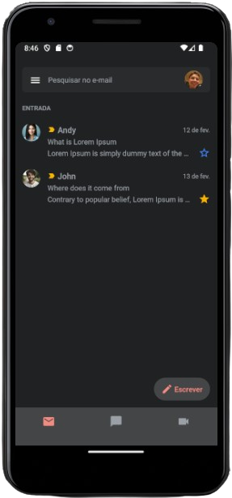

<h1 align="center">Habits</h1>

  <a href="#-tecnologias">Tecnologias</a>&nbsp;&nbsp;&nbsp;|&nbsp;&nbsp;&nbsp;
  <a href="#-projeto">Projeto</a>&nbsp;&nbsp;&nbsp;|&nbsp;&nbsp;&nbsp;
  <a href="#-como-executar">Como executar</a>&nbsp;&nbsp;&nbsp;|&nbsp;&nbsp;&nbsp;

  

## ✨ Tecnologias

Esse projeto foi desenvolvido com as seguintes tecnologias:

  - [Tailwindcss](https://tailwindcss.com)
  - [TypeScript](https://www.typescriptlang.org)
  - [React Native](https://reactnative.dev/)
  - [Clsx](https://github.com/lukeed/clsx)
  - [Expo](https://expo.dev/)
  - [Eslint - Rocketseat Plugin](https://github.com/Rocketseat/eslint-config-rocketseat)

## 💻 Projeto

O projeto consiste no clone da interface do Gmail com intuito de estudar conceitos relacionados as tecnologias utilizadas, tendo foco principal o uso de múltiplas estratégias de navegação através do expo router.

## 🚀 Como executar

Para iniciar o seu servidor Phoenix:

- Instale as dependências com `npm install`
- Inicie o projeto com `npx expo start`

Agora é só abrir o projeto no seu emulador ou smartphone!

---

Feito com ♥ by Lucas Gabriel

